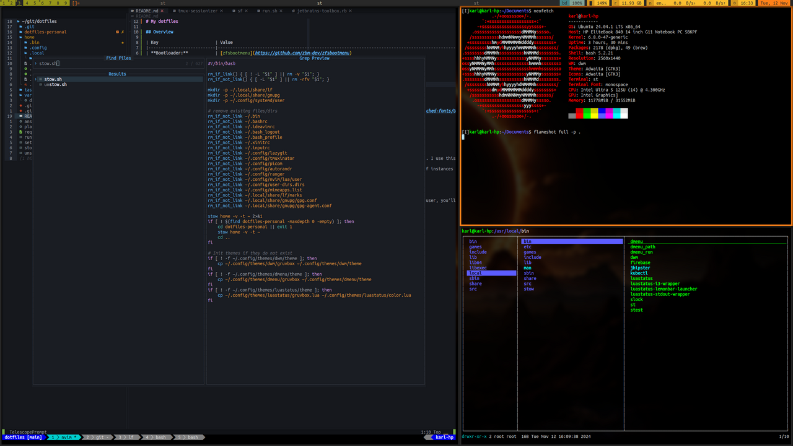

# My dotfiles



## Overview

| Key                       | Value                                                                                                      |
|---------------------------|------------------------------------------------------------------------------------------------------------|
| **Bootloader:**           | [zfsbootmenu](https://github.com/zbm-dev/zfsbootmenu)                                                      |
| **File system:**          | zfs                                                                                                        |
| **OS:**                   | Ubuntu 24.04                                                                                               |
| **Package manager:**      | apt, homebrew                                                                                              |
| **Shell:**                | bash                                                                                                       |
| **Window manager:**       | [dwm](https://github.com/bakkeby/dwm-flexipatch)                                                           |
| **Status bar:**           | [luastatus](https://github.com/shdown/luastatus)                                                           |
| **Terminal:**             | [st](https://github.com/bakkeby/st-flexipatch)                                                             |
| **Screen lock:**          | [slock](https://github.com/bakkeby/slock-flexipatch)                                                       |
| **Menu:**                 | [dmenu](https://github.com/bakkeby/dmenu-flexipatch)                                                       |
| **Compositor:**           | [picom](https://github.com/yshui/picom)                                                                    |
| **Font:**                 | [UbuntuMono Nerd Font Mono](https://github.com/ryanoasis/nerd-fonts/tree/master/patched-fonts/UbuntuMono)  |
| **Editor:**               | [neovim](https://github.com/neovim/neovim)                                                                 |
| **Terminal multiplexer:** | [tmux](https://github.com/tmux/tmux)                                                                       |
| **Hotkey daemon:**        | [sxhkd](https://github.com/baskerville/sxhkd)                                                              |
| **TUI file manager:**     | [lf](https://github.com/gokcehan/lf)                                                                       |
| **TUI git:**              | [lazygit](https://github.com/jesseduffield/lazygit)                                                        |

Some useful scripts I've written over the years:

* [tmux-sessionizer](./home/.bin/tmux-sessionizer): quickly create/switch tmux sessions; inspired by ThePrimeagen. I use this a TON!
* [zfs-snapshot-browser](./home/.bin/zfs-snapshot-browser): browse previous zfs snapshots of given directory. Useful for quickly recovering deleted/changed files.
* [sf](./home/.bin/sf): open an lf session mounted to a remote host over ssh. Works really nicely with multiple lf instances (copy files between hosts).

## Keymaps

I've remapped some keys for ergonomics:

* Caps Lock is ctrl when held down, escape when pressed once (see [remaps](./home/.bin/remaps)). If you're a vim user, you'll love this.
* Alt and winkey are swapped. Alt is powerkey for dwm.

## Installation

For a full Bash install:

```sh
./setup/setup.sh
```

Or install a specific item:

```sh
./setup/setup.sh dwm
```

------------------

## zfsbootmenu

Debootstrap.

Mount and chroot:

```sh
mount -t proc proc /mnt/proc
mount -t sysfs sys /mnt/sys
mount -B /dev /mnt/dev
mount -t devpts pts /mnt/dev/pts
chroot /mnt /bin/bash
```

Unmount:

```sh
umount -nR /mnt
```

## Credit

Borrowed inspiration and code from:

* https://github.com/junnunkarim/dotfiles-linux
* https://github.com/LukeSmithxyz/voidrice
